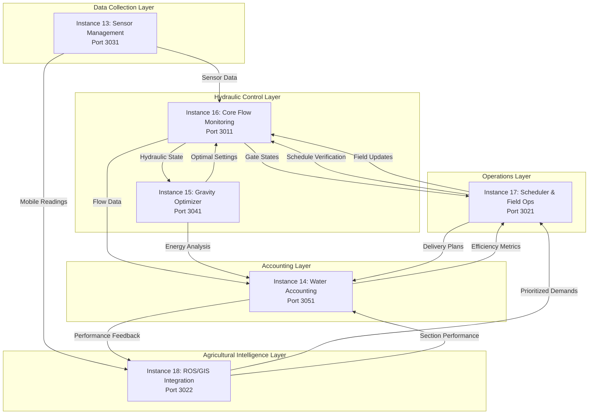

# Complete Overview: Flow Monitoring Instances 13-18

## System Architecture Overview



## Instance 13: Sensor Network Management (Port 3031)

### Purpose
Manages the limited sensor infrastructure and mobile sensor fleet to maximize coverage.

### Key Responsibilities
1. **Fixed Sensor Management (7 total)**
   - 6 water level sensors at strategic nodes
   - 1 soil moisture sensor (reference point)
   - MQTT data ingestion
   - Calibration and validation

2. **Mobile Sensor Coordination**
   - GPS-tracked portable sensors
   - Dynamic deployment algorithms
   - Coverage optimization
   - Battery management

3. **Data Quality Assurance**
   - Outlier detection
   - Missing data interpolation
   - Sensor health monitoring
   - Redundancy management

### Outputs to Other Instances
```python
# To Instance 16 (Flow Monitoring)
{
    "sensor_id": "WL-001",
    "type": "water_level",
    "location": {"lat": 14.8234, "lon": 103.1567},
    "value": 218.5,
    "unit": "m",
    "quality": "verified",
    "timestamp": "2024-01-15T10:30:00Z"
}

# To Instance 18 (ROS/GIS)
{
    "mobile_sensors": [
        {
            "sensor_id": "MOB-001",
            "current_section": "Zone_2_Section_A",
            "moisture_reading": 32.5,
            "next_location": "Zone_2_Section_B",
            "eta_minutes": 45
        }
    ]
}
```

## Instance 14: Water Accounting & Loss Tracking (Port 3051)

### Purpose
Tracks water from source to field, accounting for every drop and identifying losses.

### Key Responsibilities
1. **Volume Accounting**
   - Source water intake tracking
   - Gate-by-gate flow accounting
   - Section-level delivery confirmation
   - Loss calculation and categorization

2. **Efficiency Metrics**
   - Conveyance efficiency (canal losses)
   - Application efficiency (field losses)
   - Overall system efficiency
   - Temporal efficiency trends

3. **Financial Tracking**
   - Water usage costs
   - Loss valuations
   - Section-level billing
   - Cost recovery analysis

### Integration Points
```python
# From Instance 16 (Flow Monitoring)
flow_data = {
    "gate_id": "M(0,2)->Zone_2",
    "flow_rate_m3s": 3.5,
    "duration_hours": 4,
    "total_volume_m3": 50400
}

# To Instance 18 (ROS/GIS)
efficiency_feedback = {
    "section_id": "Zone_2_Section_A",
    "delivered_m3": 14250,
    "losses_m3": 750,
    "efficiency": 0.95,
    "deficit_m3": 750
}
```

## Instance 15: Gravity-Fed Optimization (Port 3041)

### Purpose
Optimizes water distribution using gravity to minimize energy and maximize coverage.

### Key Responsibilities
1. **Elevation-Based Routing**
   - Optimal path calculation
   - Head loss minimization
   - Pressure management
   - Reach maximization

2. **Multi-Zone Coordination**
   - Simultaneous delivery optimization
   - Interference prevention
   - Sequencing for maximum coverage
   - Emergency routing

3. **Energy Conservation**
   - Potential energy utilization
   - Friction loss reduction
   - Gate sequencing optimization
   - Natural gradient exploitation

### Optimization Outputs
```python
# To Instance 16 (Flow Monitoring)
{
    "optimization_id": "OPT-2024-W03-001",
    "gate_sequence": [
        {"gate_id": "Source->M(0,0)", "opening": 0.8, "time": "08:00"},
        {"gate_id": "M(0,0)->M(0,2)", "opening": 0.7, "time": "08:15"},
        {"gate_id": "M(0,2)->Zone_2", "opening": 0.9, "time": "08:30"}
    ],
    "expected_head_m": 221.5,
    "friction_losses_m": 2.3,
    "coverage_sections": 12,
    "optimization_score": 0.92
}
```

## Instance 16: Core Flow Monitoring (Port 3011) - CENTRAL HUB

### Purpose
The hydraulic brain that ensures water physics are respected while coordinating all operations.

### Key Responsibilities
1. **Hydraulic Calculations**
   - Gate flow equations: Q = Cs × L × Hs × √(2g × ΔH)
   - Network-wide water level solver
   - Travel time predictions
   - Capacity verification

2. **Dual-Mode Gate Control**
   - 20 automated gates (SCADA)
   - 39 manual gates (field teams)
   - Mode transitions
   - Conflict resolution

3. **Real-Time Monitoring**
   - Continuous state tracking
   - Anomaly detection
   - Performance monitoring
   - Alert generation

### Central Coordination
```python
# Receives from all instances
sensor_data = from_instance_13()
optimization = from_instance_15()
schedule_request = from_instance_17()

# Processes and validates
hydraulic_state = calculate_network_state()
feasibility = verify_schedule(schedule_request, hydraulic_state)

# Distributes results
to_instance_14(flow_measurements)
to_instance_17(feasibility_result)
to_instance_18(actual_deliveries)
```

## Instance 17: Scheduler & Field Operations (Port 3021)

### Purpose
Converts demands into actionable schedules for both automated and manual operations.

### Key Responsibilities
1. **Schedule Optimization**
   - Weekly batch planning
   - Field team routing (Tuesday/Thursday)
   - Automated gate scheduling
   - Conflict resolution

2. **Field Team Coordination**
   - Mobile app backend
   - GPS navigation
   - Offline operation support
   - Photo verification

3. **Real-Time Adaptation**
   - Schedule adjustments
   - Emergency response
   - Team redeployment
   - Status tracking

### Mobile App Integration
```python
# Field team instruction
{
    "team": "Team_A",
    "date": "2024-01-16",  # Tuesday
    "route": [
        {
            "gate_id": "M(0,0)->M(0,2)",
            "location": {"lat": 14.8220, "lon": 103.1520},
            "arrival_time": "08:00",
            "action": "open",
            "target_opening": "6 notches",
            "photo_required": true,
            "tools": ["standard_wheel"]
        }
    ]
}
```

## Instance 18: ROS/GIS Integration (Port 3022) - DEMAND TRANSLATOR

### Purpose
Bridges agricultural science with hydraulic engineering, translating crop needs into system demands.

### Key Responsibilities
1. **Demand Aggregation**
   - Crop water requirements (ROS)
   - Spatial mapping (GIS)
   - Section-to-gate assignment
   - Weather adjustments

2. **Priority Resolution**
   - Multi-factor scoring:
     - Crop stage (40% weight)
     - Moisture deficit (30% weight)
     - Economic value (20% weight)
     - Stress indicators (10% weight)

3. **Performance Feedback**
   - Delivery tracking
   - Efficiency analysis
   - Deficit management
   - Model updates

### GraphQL API Example
```graphql
mutation SubmitWeeklyDemands {
  submitDemands(
    week: "2024-W03"
    demands: [
      {
        sectionId: "Zone_2_Section_A"
        volumeM3: 15000
        priority: "critical"
      }
    ]
  ) {
    scheduleId
    conflicts
  }
}
```

## Complete Data Flow Example: From Crop Need to Water Delivery

### Monday - Planning Phase
1. **Instance 18** queries crop models: "Rice at flowering stage needs 100mm"
2. **Instance 18** calculates: "Zone_2_Section_A needs 15,000 m³, priority 9/10"
3. **Instance 18** aggregates: "Gate M(0,2)->Zone_2 must deliver 45,000 m³"
4. **Instance 17** receives demands, optimizes schedule
5. **Instance 17** queries **Instance 16**: "Is this feasible?"
6. **Instance 16** runs hydraulic model: "Yes, requires 4 hours at 3.5 m³/s"
7. **Instance 15** optimizes: "Best sequence: Open upstream gates 15 min early"
8. **Instance 17** finalizes: "Team A on Tuesday 8 AM"

### Tuesday - Execution Phase
1. **Instance 13** reports: "Water level at M(0,0) is 219.2m"
2. Team A uses mobile app from **Instance 17**
3. Team opens manual gates, photos uploaded
4. **Instance 16** detects changes, recalculates network
5. **Instance 16** tracks flow: "3.5 m³/s flowing to Zone 2"
6. **Instance 14** logs: "50,400 m³ released from source"

### Wednesday - Monitoring Phase
1. **Instance 13** mobile sensor: "Zone_2_Section_A moisture increased to 45%"
2. **Instance 16** reports: "14,250 m³ delivered to section"
3. **Instance 14** calculates: "750 m³ losses (95% efficiency)"
4. **Instance 18** updates: "Section deficit cleared, reduce next priority"

### Thursday - Adaptation Phase
1. **Instance 16** alerts: "Gate M(0,5)->Zone_5 failed"
2. **Instance 17** adapts: "Redirect Team B for manual operation"
3. **Instance 15** recalculates: "Alternative route via M(0,4)"
4. **Instance 18** adjusts: "Increase Zone 5 priority for next week"

## Inter-Instance Communication Matrix

| From → To | 13 | 14 | 15 | 16 | 17 | 18 |
|-----------|----|----|----|----|----|----|
| **13: Sensors** | - | ✓ | | ✓ | | ✓ |
| **14: Accounting** | | - | | | ✓ | ✓ |
| **15: Optimizer** | | ✓ | - | ✓ | ✓ | |
| **16: Flow Monitor** | | ✓ | ✓ | - | ✓ | ✓ |
| **17: Scheduler** | | | | ✓ | - | |
| **18: ROS/GIS** | | | | | ✓ | - |

## Technology Stack by Instance

| Instance | Language | Framework | Database | Special Tech |
|----------|----------|-----------|----------|--------------|
| 13: Sensors | Go | Gin | InfluxDB | MQTT, GPS |
| 14: Accounting | Python | FastAPI | PostgreSQL | Time-series |
| 15: Optimizer | Python | FastAPI | Redis | OR-Tools |
| 16: Flow Monitor | Python | FastAPI | Multiple | OPC UA |
| 17: Scheduler | Python | FastAPI | PostgreSQL | React Native |
| 18: ROS/GIS | Python | FastAPI + GraphQL | PostGIS | Spatial |

## Key Design Principles

1. **Separation of Concerns**: Each instance has a specific domain
2. **Loose Coupling**: Services communicate via APIs, not shared databases
3. **Fault Tolerance**: System degrades gracefully if an instance fails
4. **Real-Time Capable**: Critical paths support <1 second response
5. **Offline Operation**: Field operations continue without connectivity

## Failure Scenarios and Resilience

### If Instance 13 (Sensors) Fails:
- System continues with last known values
- Manual readings can be entered
- Conservative safety margins applied

### If Instance 16 (Flow Monitor) Fails:
- **CRITICAL**: Manual operation only
- Pre-calculated schedules executed
- No real-time verification

### If Instance 17 (Scheduler) Fails:
- Field teams use last known schedule
- Manual gate operation continues
- Automated gates maintain positions

### If Instance 18 (ROS/GIS) Fails:
- Use historical demand patterns
- Manual priority assignment
- Reduced optimization

## Summary

The six instances work as an integrated system where:
- **Instance 13** provides the eyes (sensors)
- **Instance 16** provides the brain (hydraulics)
- **Instance 17** provides the hands (operations)
- **Instance 18** provides the wisdom (agricultural knowledge)
- **Instance 14** provides the memory (accounting)
- **Instance 15** provides the optimization (efficiency)

Together, they ensure water flows from source to crop efficiently, accountably, and sustainably.