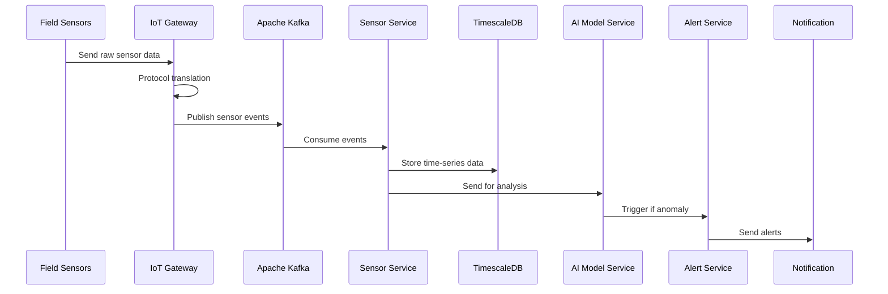
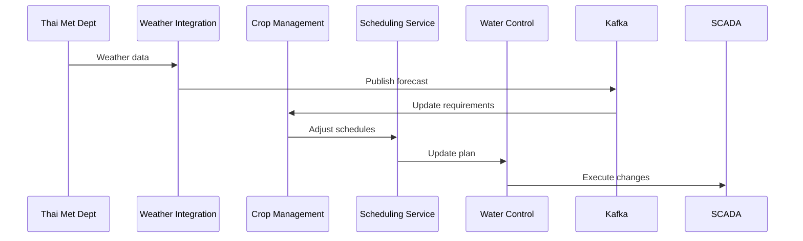
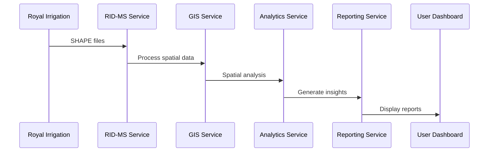

# Munbon Irrigation Control System - End-to-End Process Flow

## System Overview

The Munbon Irrigation Control System is a comprehensive microservices-based solution designed to automate and optimize water distribution for Thailand's Munbon Irrigation Project. The system consists of 55 tasks organized into infrastructure setup, core services, supporting services, and integration components.

## High-Level Architecture Diagram

```mermaid
graph TB
    subgraph "External Systems"
        SCADA[GE iFix SCADA]
        RID[Royal Irrigation Dept]
        TMD[Thai Meteorological Dept]
        AOS[Aeronautical Stations]
        FIELD[Field Devices/Sensors]
    end

    subgraph "Edge Layer"
        IOT[IoT Gateway Service<br/>Task 41]
    end

    subgraph "API Gateway Layer"
        KONG[Kong API Gateway<br/>Task 3]
    end

    subgraph "BFF Layer"
        WEB_BFF[Web BFF Service<br/>Task 43]
        MOBILE_BFF[Mobile BFF Service<br/>Task 42]
        MAIN_BFF[Main BFF Service<br/>Task 35]
    end

    subgraph "Core Services"
        AUTH[Auth Service<br/>Task 4]
        GIS[GIS Data Service<br/>Task 6]
        SENSOR[Sensor Data Service<br/>Task 8]
        SCADA_INT[SCADA Integration<br/>Task 10]
        AI[AI Model Service<br/>Task 12]
        WATER_CTRL[Water Distribution Control<br/>Task 13]
        USER[User Management<br/>Task 26]
    end

    subgraph "Domain Services"
        WEATHER_INT[Weather Integration<br/>Task 27]
        WEATHER_MON[Weather Monitoring<br/>Task 55]
        CROP[Crop Management<br/>Task 28]
        SCHEDULE[Scheduling Service<br/>Task 29]
        MOISTURE[Moisture Service<br/>Task 44]
        WATER_LEVEL[Water Level Service<br/>Task 46]
        FLOW_MON[Flow/Volume Monitoring<br/>Task 50]
    end

    subgraph "Integration Services"
        RID_MS[RID-MS Service<br/>Task 48]
        RID_API[RID API Service<br/>Task 49]
        ROS[ROS Service<br/>Task 47]
        AOS_INT[AOS Service<br/>Task 45]
        DATA_INT[Data Integration<br/>Task 34]
    end

    subgraph "Support Services"
        NOTIFY[Notification Service<br/>Task 15]
        ALERT[Alert Management<br/>Task 32]
        CONFIG[Configuration Service<br/>Task 33]
        ANALYTICS[Analytics Service<br/>Task 30]
        MAINT[Maintenance Service<br/>Task 31]
        REPORT[Reporting Service<br/>Task 18]
        FILE[File Processing<br/>Task 19]
        AUDIT[Audit Log Service<br/>Task 40]
        MONITOR[System Monitoring<br/>Task 17]
    end

    subgraph "Optimization Services"
        OPT[Optimization Service<br/>Task 51]
        MPC[Model Predictive Control<br/>Task 52]
    end

    subgraph "Real-time Services"
        WEBSOCKET[WebSocket Service<br/>Task 21]
        GRAPHQL[GraphQL API<br/>Task 20]
    end

    subgraph "Data Layer"
        PG[PostgreSQL+PostGIS<br/>Tasks 5]
        TS[TimescaleDB<br/>Task 7]
        MONGO[MongoDB<br/>Task 11]
        REDIS[Redis<br/>Task 14]
        INFLUX[InfluxDB<br/>Task 16]
    end

    subgraph "Infrastructure"
        K8S[Kubernetes<br/>Task 1]
        DOCKER[Docker<br/>Task 2]
        KAFKA[Apache Kafka<br/>Task 9]
        CICD[CI/CD Pipeline<br/>Task 22]
    end

    %% External connections
    FIELD --> IOT
    SCADA --> SCADA_INT
    RID --> RID_MS
    RID --> RID_API
    TMD --> WEATHER_INT
    AOS --> AOS_INT

    %% IoT to Core
    IOT --> KONG
    IOT --> SENSOR

    %% API Gateway connections
    KONG --> AUTH
    KONG --> WEB_BFF
    KONG --> MOBILE_BFF
    KONG --> MAIN_BFF

    %% BFF connections
    WEB_BFF --> WATER_CTRL
    WEB_BFF --> GIS
    WEB_BFF --> ANALYTICS
    MOBILE_BFF --> SENSOR
    MOBILE_BFF --> ALERT
    MAIN_BFF --> CROP
    MAIN_BFF --> SCHEDULE

    %% Core service interactions
    SCADA_INT --> WATER_CTRL
    SENSOR --> AI
    AI --> WATER_CTRL
    WATER_CTRL --> OPT
    OPT --> MPC

    %% Domain service interactions
    WEATHER_INT --> WEATHER_MON
    AOS_INT --> WEATHER_MON
    MOISTURE --> WATER_CTRL
    WATER_LEVEL --> FLOW_MON
    FLOW_MON --> WATER_CTRL

    %% Support service connections
    ALERT --> NOTIFY
    MONITOR --> ALERT
    ANALYTICS --> REPORT

    %% Data flow
    SENSOR --> TS
    GIS --> PG
    CONFIG --> MONGO
    AUTH --> REDIS
    MONITOR --> INFLUX

    %% Event streaming
    KAFKA --> DATA_INT
    DATA_INT --> ANALYTICS
```



## System Layers and Task Groupings

### 1. Infrastructure Foundation (Tasks 1-2, 9, 22, 36-39, 53)
- **Kubernetes Setup** (Task 1) - Container orchestration platform
- **Docker Containerization** (Task 2) - Container runtime
- **Apache Kafka** (Task 9) - Event streaming platform
- **CI/CD Pipeline** (Task 22) - Automated deployment
- **Project Structure** (Tasks 36-39, 53) - Codebase organization

### 2. Data Storage Layer (Tasks 5, 7, 11, 14, 16)
- **PostgreSQL + PostGIS** (Task 5) - Spatial and relational data
- **TimescaleDB** (Task 7) - Time-series sensor data
- **MongoDB** (Task 11) - Document storage
- **Redis** (Task 14) - Caching and sessions
- **InfluxDB** (Task 16) - Metrics and monitoring

### 3. Gateway and Security Layer (Tasks 3-4, 26, 40)
- **API Gateway** (Task 3) - Request routing and rate limiting
- **Authentication Service** (Task 4) - OAuth 2.0, JWT, Thai Digital ID
- **User Management** (Task 26) - Profiles, roles, permissions
- **Audit Log Service** (Task 40) - Compliance and security logging

### 4. Core Domain Services (Tasks 6, 8, 10, 12-13)
- **GIS Data Service** (Task 6) - Spatial operations
- **Sensor Data Service** (Task 8) - IoT data ingestion
- **SCADA Integration** (Task 10) - Industrial control systems
- **AI Model Service** (Task 12) - Machine learning inference
- **Water Distribution Control** (Task 13) - Core optimization engine

### 5. External Integration Services (Tasks 27, 41, 45, 47-49, 54)
- **Weather Integration** (Task 27) - Thai Meteorological Department
- **IoT Gateway** (Task 41) - Field device bridge
- **AOS Service** (Task 45) - Aeronautical weather stations
- **ROS Service** (Task 47) - Reservoir operations
- **RID Services** (Tasks 48-49) - Royal Irrigation Department
- **AOS Data Import** (Task 54) - Historical weather data

### 6. Domain-Specific Services (Tasks 28-29, 44, 46, 50, 55)
- **Crop Management** (Task 28) - AquaCrop integration
- **Scheduling Service** (Task 29) - Irrigation scheduling
- **Moisture Service** (Task 44) - Soil moisture monitoring
- **Water Level Service** (Task 46) - Level monitoring
- **Flow Monitoring** (Task 50) - Hydraulic measurements
- **Weather Monitoring** (Task 55) - Consolidated weather data

### 7. Support Services (Tasks 15, 17-19, 30-34)
- **Notification Service** (Task 15) - Multi-channel alerts
- **System Monitoring** (Task 17) - Health checks
- **Reporting Service** (Task 18) - Report generation
- **File Processing** (Task 19) - Large file handling
- **Analytics Service** (Task 30) - Data analysis
- **Maintenance Service** (Task 31) - Equipment tracking
- **Alert Management** (Task 32) - Alert rules engine
- **Configuration Service** (Task 33) - Dynamic config
- **Data Integration** (Task 34) - ETL operations

### 8. Client-Facing Services (Tasks 20-21, 35, 42-43)
- **GraphQL API** (Task 20) - Complex queries
- **WebSocket Service** (Task 21) - Real-time updates
- **Main BFF Service** (Task 35) - General frontend aggregation
- **Mobile BFF** (Task 42) - Mobile-optimized APIs
- **Web BFF** (Task 43) - Web dashboard APIs

### 9. Advanced Control Services (Tasks 51-52)
- **Optimization Service** (Task 51) - Mathematical optimization
- **MPC Service** (Task 52) - Model Predictive Control

### 10. Operations and Compliance (Tasks 23-25)
- **Backup & Recovery** (Task 23) - Data protection
- **API Documentation** (Task 24) - Developer resources
- **Security Compliance** (Task 25) - Thai government compliance

## End-to-End Process Flows

### 1. Sensor Data Collection and Processing Flow



### 2. Water Distribution Control Flow

```mermaid
sequenceDiagram
    participant User as User/Scheduler
    participant BFF as BFF Service
    participant Auth as Auth Service
    participant Water as Water Control
    participant AI as AI Model
    participant Opt as Optimization
    participant SCADA as SCADA Integration
    participant Field as Field Equipment

    User->>BFF: Request irrigation
    BFF->>Auth: Verify permissions
    Auth->>BFF: Authorized
    BFF->>Water: Initiate control
    Water->>AI: Get predictions
    Water->>Opt: Optimize distribution
    Opt->>Water: Optimal plan
    Water->>SCADA: Send commands
    SCADA->>Field: Actuate gates/pumps
```

### 3. Weather-Based Irrigation Planning



### 4. Spatial Analysis and Reporting



## Key Integration Patterns

### 1. Event-Driven Architecture
- All services communicate through Kafka for loose coupling
- Real-time events trigger automated responses
- Asynchronous processing for scalability

### 2. API Gateway Pattern
- Kong manages all external API requests
- Authentication, rate limiting, and routing
- Service discovery and load balancing

### 3. BFF Pattern
- Separate backends for web, mobile, and general clients
- Optimized data aggregation per client type
- Reduced network calls from clients

### 4. Microservices Communication
- Synchronous: REST APIs through API Gateway
- Asynchronous: Kafka event streaming
- Real-time: WebSocket connections
- Complex queries: GraphQL endpoints

### 5. Data Management
- Polyglot persistence (multiple databases)
- CQRS pattern for read/write separation
- Event sourcing for audit trails

## System Dependencies and Build Order

### Phase 1: Infrastructure (Tasks 1-3, 5, 7, 9, 11, 14, 16, 36-39, 53)
Foundation setup including Kubernetes, databases, and messaging

### Phase 2: Core Services (Tasks 4, 6, 8, 10, 12-13, 26)
Essential services for authentication, data collection, and control

### Phase 3: Integration Services (Tasks 27, 34, 41, 45, 47-49, 54-55)
External system connections and data integration

### Phase 4: Domain Services (Tasks 28-29, 44, 46, 50)
Specialized irrigation domain functionality

### Phase 5: Support Services (Tasks 15, 17-19, 30-33, 40)
Monitoring, alerting, and operational support

### Phase 6: Client Services (Tasks 20-21, 35, 42-43)
Frontend support and real-time capabilities

### Phase 7: Advanced Features (Tasks 51-52)
Optimization and predictive control

### Phase 8: Operations (Tasks 22-25)
CI/CD, documentation, and compliance

## Current Progress
- **Completed**: 21 tasks (38%)
- **Infrastructure**: ✅ Complete
- **Core Services**: Partially complete
- **Integration**: In progress
- **Support Services**: Pending

The system is designed for high scalability (10,000+ connections), sub-second response times, and 99.9% uptime while complying with Thai government security requirements.