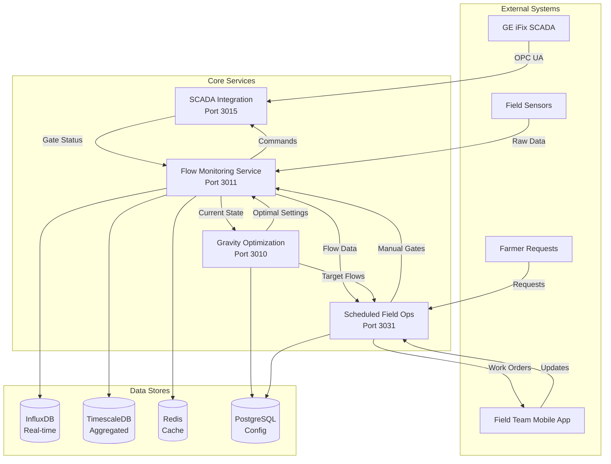

# Flow Monitoring Integration Architecture

## Service Overview

The Munbon irrigation system consists of four core services that work together to optimize water distribution:

1. **Flow Monitoring Service** (Port 3011) - THIS SERVICE
2. **Gravity Optimization Service** (Port 3010)
3. **Scheduled Field Operation Service** (Port 3031)
4. **SCADA Integration Service** (Port 3015)

## Service Relationships



## Detailed Service Interactions

### 1. Flow Monitoring Service (This Service)

**Primary Responsibilities:**
- Real-time hydraulic state calculation
- Gate flow monitoring
- Water level tracking
- Network hydraulic solving
- Mode transition control

**Data It Provides:**
```json
{
  "current_state": {
    "timestamp": "2024-12-15T10:30:00Z",
    "water_levels": {
      "M(0,0)": 220.5,
      "M(0,1)": 219.8,
      "M(0,2)": 219.6
    },
    "gate_flows": {
      "M(0,0)->M(0,1)": 5.2,
      "M(0,1)->1R-LMC": 2.1
    },
    "gate_positions": {
      "G001": {"opening_m": 1.2, "percentage": 48},
      "G002": {"opening_m": 0.8, "percentage": 40}
    },
    "system_efficiency": 0.87,
    "total_inflow": 45.3,
    "total_delivery": 39.4
  }
}
```

**Data It Consumes:**
- Sensor readings (water levels, flow meters)
- Gate positions from SCADA
- Manual gate updates from SFO
- Optimization targets from Gravity Optimizer

### 2. Gravity Optimization Service

**Primary Responsibilities:**
- Multi-objective optimization
- Demand-supply matching
- Energy minimization
- Equitable distribution

**Integration with Flow Monitoring:**

```python
# Gravity Optimizer queries Flow Monitoring
GET /api/v1/flow/network-state
Response: Current hydraulic state

# Gravity Optimizer sends targets to Flow Monitoring
POST /api/v1/control/optimization-targets
{
  "optimization_id": "OPT-2024-1215-001",
  "targets": {
    "zone_flows": {
      "Zone1": 8.5,
      "Zone2": 12.3,
      "Zone3": 10.1
    },
    "gate_suggestions": {
      "G001": {"opening": 0.85, "reasoning": "maximize_flow"},
      "G002": {"opening": 0.45, "reasoning": "balance_distribution"}
    },
    "constraints": {
      "max_velocity": 2.0,
      "min_water_level": 0.3,
      "priority_zones": ["Zone3", "Zone1"]
    }
  }
}
```

### 3. Scheduled Field Operation Service

**Primary Responsibilities:**
- Weekly operation planning
- Manual gate scheduling
- Field team coordination
- Work order management

**Integration with Flow Monitoring:**

```python
# SFO queries current state before planning
GET /api/v1/flow/manual-gates-state

# SFO updates Flow Monitoring with planned manual operations
POST /api/v1/control/manual-gate-schedule
{
  "schedule_id": "SCH-2024-W51",
  "week": "2024-W51",
  "operations": [
    {
      "gate_id": "G025",
      "scheduled_time": "2024-12-16T08:00:00Z",
      "target_opening": 1.5,
      "team": "Field-A",
      "estimated_duration": 30
    }
  ]
}

# Flow Monitoring notifies SFO of actual manual gate changes
POST /api/v1/field-ops/gate-update-notification
{
  "gate_id": "G025",
  "actual_opening": 1.45,
  "completed_time": "2024-12-16T08:25:00Z",
  "operator": "Team-A-Leader"
}
```

### 4. SCADA Integration Service

**Primary Responsibilities:**
- OPC UA communication
- Protocol translation
- Command queuing
- Status monitoring

**Integration Pattern:**

```
Flow Monitoring <--> SCADA Integration <--> GE iFix
      ↑                                         ↑
      |                                         |
   Commands                                  Hardware
   & Status                                  Controllers
```

## Data Flow Patterns

### 1. Real-Time Control Loop (Automated Gates)

```
Sensors → Flow Monitoring → Current State
                ↓
         Gravity Optimizer
                ↓
         Optimal Settings
                ↓
         Flow Monitoring
                ↓
         Gate Commands → SCADA Integration → Physical Gates
                ↓
         Status Feedback ←──────────────────┘
```

### 2. Weekly Planning Loop (Manual Gates)

```
Monday Planning:
Gravity Optimizer → Weekly Targets
                         ↓
               Scheduled Field Operations
                         ↓
                   Work Orders
                         ↓
                 Field Teams (Mobile)
                         ↓
During Week:     Manual Adjustments
                         ↓
                 Flow Monitoring (Updates State)
                         ↓
                 Gravity Optimizer (Re-optimizes)
```

### 3. Mode Transition Flow

```
Normal Operation (Auto Mode)
            ↓
    Failure Detection
    - Sensor fault
    - Communication loss
    - Equipment failure
            ↓
    Flow Monitoring (Initiates Transition)
            ↓
    State Preservation
            ↓
    Notify SFO → Generate Emergency Work Order
            ↓
    Manual Mode Active
            ↓
    Recovery → Gradual Transition → Auto Mode
```

## API Contracts Between Services

### Flow Monitoring ↔ Gravity Optimization

```yaml
# Flow Monitoring provides:
GET /api/v1/hydraulics/state
GET /api/v1/hydraulics/constraints
GET /api/v1/flow/capacity-analysis
POST /api/v1/hydraulics/simulate  # What-if scenarios

# Flow Monitoring consumes:
POST /api/v1/control/apply-optimization
GET /api/v1/optimization/current-targets
WebSocket: ws://gravity-opt:3010/real-time-updates
```

### Flow Monitoring ↔ Scheduled Field Operations

```yaml
# Flow Monitoring provides:
GET /api/v1/gates/manual-only
GET /api/v1/gates/manual-history
GET /api/v1/flow/travel-times  # For scheduling
POST /api/v1/gates/manual-update-callback

# Flow Monitoring consumes:
GET /api/v1/field-ops/current-schedule
GET /api/v1/field-ops/gate-assignments
WebSocket: ws://field-ops:3031/manual-updates
```

### Flow Monitoring ↔ SCADA Integration

```yaml
# Flow Monitoring provides:
POST /api/v1/scada/gate-commands
GET /api/v1/scada/health-check
POST /api/v1/scada/emergency-stop

# Flow Monitoring consumes:
WebSocket: ws://scada:3015/gate-status
GET /api/v1/scada/current-positions
GET /api/v1/scada/fault-status
```

## State Synchronization

### Shared State Model

```json
{
  "system_state": {
    "timestamp": "2024-12-15T10:30:00Z",
    "version": 1234,
    "mode": "normal|transition|emergency",
    "gates": {
      "G001": {
        "mode": "auto",
        "operational": true,
        "position": 0.85,
        "flow": 5.2,
        "last_update": "2024-12-15T10:29:45Z",
        "source": "scada"
      },
      "G025": {
        "mode": "manual",
        "operational": true,
        "position": 1.2,
        "flow": 3.1,
        "last_update": "2024-12-15T08:30:00Z",
        "source": "field_team"
      }
    },
    "zones": {
      "Zone1": {
        "demand": 8.5,
        "actual": 8.3,
        "efficiency": 0.91
      }
    }
  }
}
```

### Synchronization Mechanisms

1. **Event-Driven Updates**
   - Each service publishes state changes
   - Others subscribe to relevant events
   - Apache Kafka for event streaming

2. **Periodic Reconciliation**
   - Every 5 minutes: Full state sync
   - Detect and resolve conflicts
   - Maintain consistency

3. **Transaction Boundaries**
   - Optimization cycles are atomic
   - Mode transitions are coordinated
   - Rollback capabilities

## Failure Handling

### Service Degradation Hierarchy

```
All Services Operational
         ↓ (SCADA fails)
Manual Mode + Optimization
         ↓ (Optimizer fails)
Manual Mode + Historical Patterns
         ↓ (Flow Monitoring fails)
Emergency Manual Operations Only
```

### Data Consistency

- **Primary Source of Truth**: Flow Monitoring for current state
- **Backup**: TimescaleDB for historical recovery
- **Conflict Resolution**: Latest timestamp wins
- **Audit Trail**: All changes logged with source

## Performance Considerations

### Data Volume
- 10,000+ sensor readings/second
- 59 gates with 1Hz position updates
- 6 zones with continuous optimization

### Latency Requirements
- Sensor → State Update: <100ms
- Optimization Cycle: <5 seconds
- Manual Update Propagation: <1 second
- Emergency Response: <500ms

### Caching Strategy
- Redis for current state (TTL: 60s)
- Local caches for static data
- Websocket for real-time updates