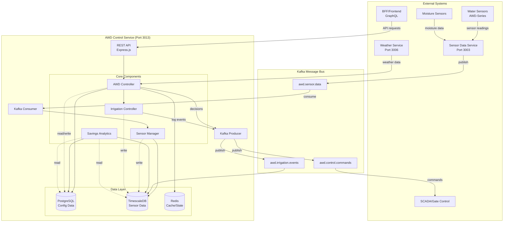

# AWD Control Service Architecture & Flow Diagram

## 1. Service Configuration

### Local Port
- **Port: 3013** (AWD Control Service API)

### Database Connections (ALL on AWS EC2: 43.209.22.250)
1. **PostgreSQL** (Port 5432)
   - Database: `munbon_dev`
   - Schema: `awd`
   - Purpose: Configuration and state management
   
2. **TimescaleDB** (Port 5432)
   - Database: `sensor_data`
   - Schema: `public`
   - Purpose: Time-series sensor data

3. **Redis** (Port 6379)
   - URL: `redis://redis:6379`
   - Purpose: Caching and real-time state

## 2. Service Flow Diagram



## 3. Data Flow Details

### 3.1 Sensor Data Ingestion Flow
```
1. AWD/Moisture sensors → Sensor Data Service (3003)
2. Sensor Data Service → Kafka (awd.sensor.data topic)
3. AWD Service consumes → Validates → Stores in TimescaleDB
4. Updates sensor status in PostgreSQL (awd.awd_sensors)
5. Caches current readings in Redis
```

### 3.2 AWD Control Decision Flow
```
1. Current water level from sensors/cache
2. Weather forecast integration
3. Growth stage from configuration
4. AWD algorithm calculates:
   - Should irrigate? (below threshold)
   - How long to irrigate?
   - Priority queue position
5. Decision stored in PostgreSQL
6. Command published to Kafka
7. SCADA system executes
```

### 3.3 API Request Flow
```
1. Frontend/BFF → GET /api/v1/awd/fields/:id/status
2. Check Redis cache first
3. If miss, query PostgreSQL + TimescaleDB
4. Aggregate data (config + latest readings)
5. Cache result in Redis (TTL: 60s)
6. Return response
```

## 4. Database Access Patterns

### PostgreSQL (munbon_dev.awd schema) - READ & WRITE
```sql
-- Configuration Tables (Frequent reads, occasional writes)
- awd_fields: Field registration and metadata
- awd_configurations: AWD parameters per field
- awd_sensors: Sensor registration and status
- irrigation_schedules: Planned irrigation events
- awd_field_cycles: Current wetting/drying cycle state

-- Write Operations:
- INSERT/UPDATE configurations
- UPDATE sensor status
- INSERT irrigation schedules
- UPDATE cycle states
```

### TimescaleDB (sensor_data) - WRITE Heavy, READ for Analytics
```sql
-- Time-series Tables (High-frequency writes, analytical reads)
- awd_sensor_readings: Raw sensor data (every 5-15 min)
- irrigation_events: Irrigation start/stop events

-- Write Operations:
- INSERT sensor readings (bulk)
- INSERT irrigation events

-- Read Operations:
- Time-range queries for analytics
- Aggregations for water savings
- Latest value queries
```

### Redis (Cache) - READ & WRITE
```
-- Cached Data (TTL-based)
- field:{id}:config - Field configuration (TTL: 5min)
- field:{id}:status - Current AWD status (TTL: 60s)
- sensor:{id}:latest - Latest reading (TTL: 60s)
- irrigation:queue - Active irrigation queue

-- Real-time State:
- irrigation:active:{fieldId} - Current irrigation status
- alerts:pending - Pending alerts
```

## 5. Integration Points

### Incoming Integrations
1. **Sensor Data Service** (Port 3003)
   - Water level readings
   - Moisture readings
   - Sensor registration

2. **Weather Service** (Port 3006)
   - Rainfall forecasts
   - ET (Evapotranspiration) data

3. **Kafka Consumer**
   - Topic: `awd.sensor.data`
   - Real-time sensor updates

### Outgoing Integrations
1. **Kafka Producer**
   - Topic: `awd.control.commands` → SCADA
   - Topic: `awd.irrigation.events` → Analytics

2. **Alert Service**
   - Critical water level alerts
   - Sensor failure notifications

## 6. Service Responsibilities

### Primary Functions
1. **AWD Cycle Management**
   - Monitor water levels
   - Determine irrigation timing
   - Track wetting/drying phases

2. **Sensor Management**
   - Register AWD sensors
   - Monitor sensor health
   - Handle sensor failures

3. **Irrigation Control**
   - Generate irrigation commands
   - Queue management
   - Conflict resolution

4. **Analytics & Reporting**
   - Water savings calculation
   - Yield impact analysis
   - Efficiency metrics

### API Endpoints
- Field management: `/api/v1/awd/fields`
- Sensor data: `/api/v1/awd/fields/:id/sensors`
- Control: `/api/v1/awd/fields/:id/control`
- Analytics: `/api/v1/awd/analytics`
- Schedules: `/api/v1/awd/schedules`

## 7. High Availability Considerations

1. **Database Connections**
   - All databases on EC2 (single point of failure)
   - Connection pooling with retry logic
   - Health checks every 30s

2. **Caching Strategy**
   - Redis for reducing database load
   - Fallback to database if cache miss
   - Short TTLs for real-time data

3. **Message Queue**
   - Kafka for reliable message delivery
   - Consumer groups for scaling
   - Message replay capability