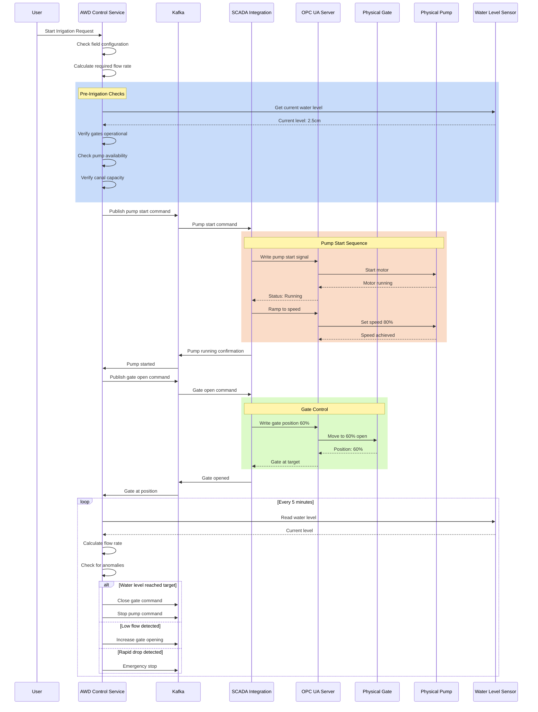
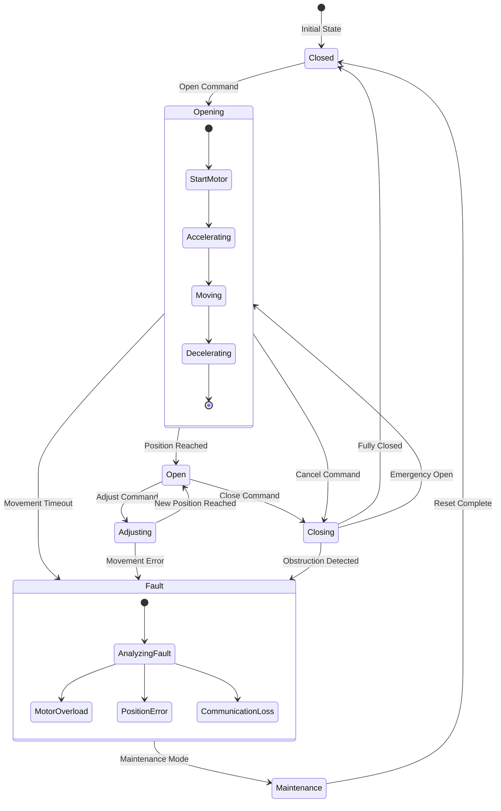
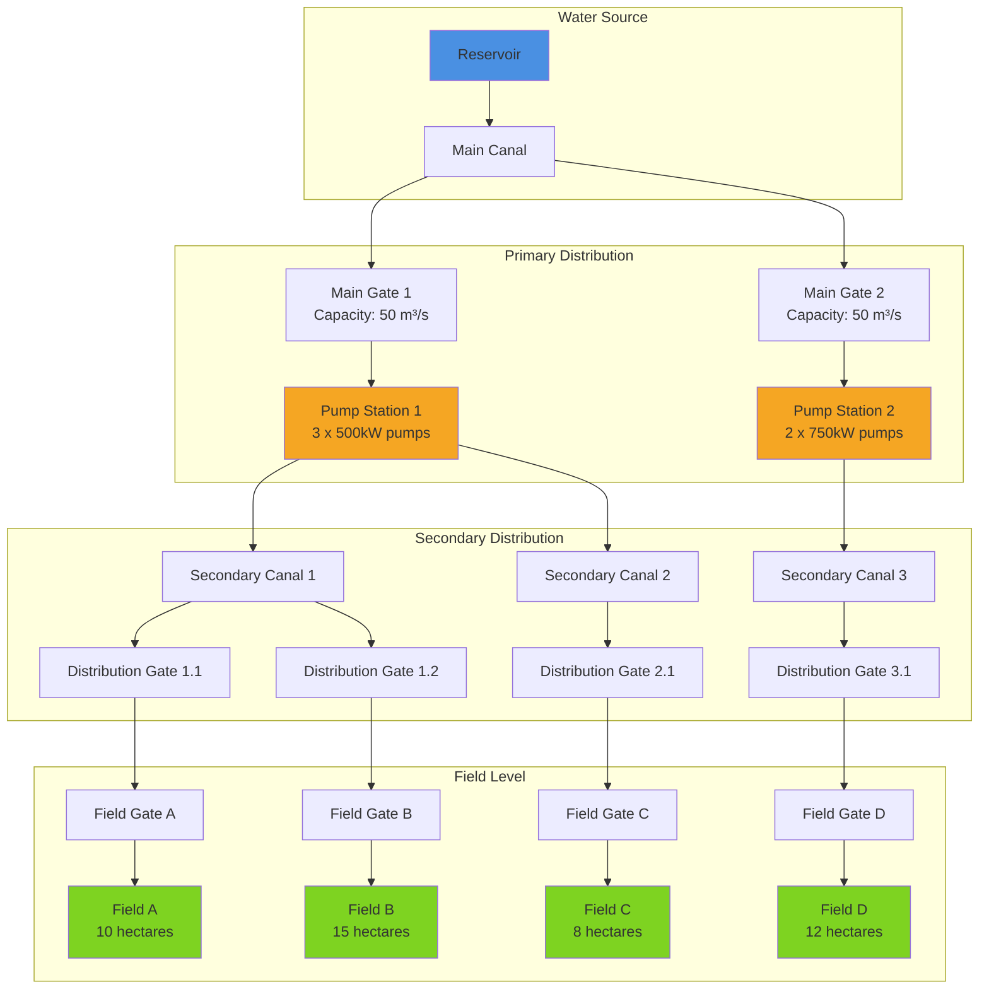
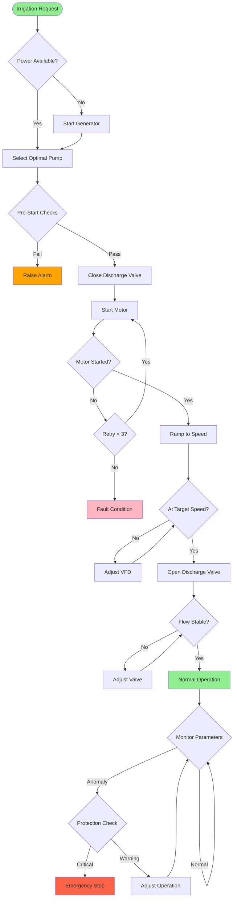
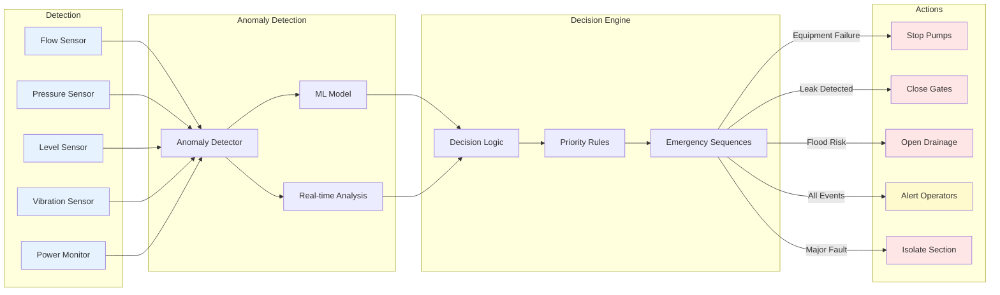
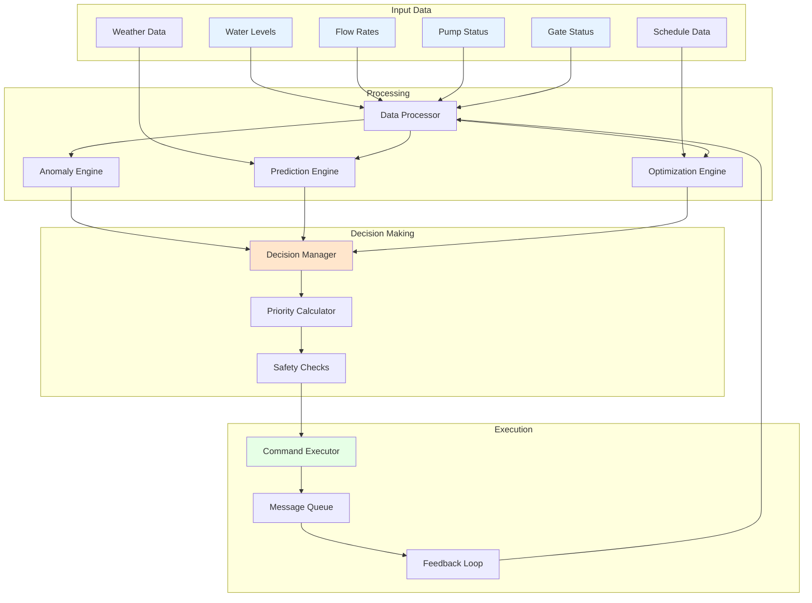

# Infrastructure Control Flow Diagrams

## 1. Complete Irrigation Control Flow



## 2. Gate Control State Machine



## 3. Water Distribution Network



## 4. Pump Control Logic



## 5. Emergency Response System



## 6. Communication Architecture

```mermaid
graph TB
    subgraph "AWD Control Service"
        API[REST API]
        CL[Control Logic]
        ML[ML Engine]
        DB[(PostgreSQL)]
    end
    
    subgraph "Message Bus"
        K1[Kafka Topic:<br/>gate.commands]
        K2[Kafka Topic:<br/>pump.commands]
        K3[Kafka Topic:<br/>sensor.data]
        K4[Kafka Topic:<br/>system.alerts]
    end
    
    subgraph "SCADA Integration Layer"
        SI[SCADA Interface]
        OPC[OPC UA Client]
        MB[Modbus Client]
        Q[Command Queue]
    end
    
    subgraph "Field Infrastructure"
        GE[GE iFix Server]
        PLC1[PLC Station 1]
        PLC2[PLC Station 2]
        RTU[Remote Terminal Units]
    end
    
    subgraph "Physical Devices"
        G1[Gate 1]
        G2[Gate 2]
        P1[Pump 1]
        P2[Pump 2]
        WL[Water Level Sensors]
        FM[Flow Meters]
    end
    
    API --> CL
    CL --> K1
    CL --> K2
    CL <--> DB
    ML <--> DB
    
    K1 --> SI
    K2 --> SI
    K3 <-- SI
    K4 <-- SI
    
    SI --> Q
    Q --> OPC
    Q --> MB
    
    OPC <--> GE
    MB <--> RTU
    
    GE --> PLC1
    GE --> PLC2
    PLC1 --> G1
    PLC1 --> P1
    PLC2 --> G2
    PLC2 --> P2
    RTU --> WL
    RTU --> FM
    
    style API fill:#4A90E2
    style K1 fill:#F5A623
    style K2 fill:#F5A623
    style K3 fill:#F5A623
    style K4 fill:#F5A623
    style GE fill:#50E3C2
    style G1 fill:#7ED321
    style G2 fill:#7ED321
    style P1 fill:#7ED321
    style P2 fill:#7ED321
```

## 7. Control Priority Matrix

| Scenario | Gate Priority | Pump Priority | Response Time | Override Level |
|----------|--------------|---------------|---------------|----------------|
| Normal Irrigation | Medium | Medium | 5 minutes | Field Operator |
| Low Water Alert | High | Low | 2 minutes | System Auto |
| Flood Risk | Emergency | Emergency | 30 seconds | System Auto |
| Equipment Failure | High | High | 1 minute | Control Room |
| Power Outage | N/A | Emergency | Immediate | System Auto |
| Maintenance Mode | Low | Low | Manual | Maintenance Team |
| Emergency Stop | Emergency | Emergency | Immediate | Any Operator |

## 8. Data Flow for Decision Making



These diagrams illustrate the complete flow of how the AWD Control Service manages physical infrastructure, from high-level decision making down to actual hardware control, including safety systems and emergency responses.