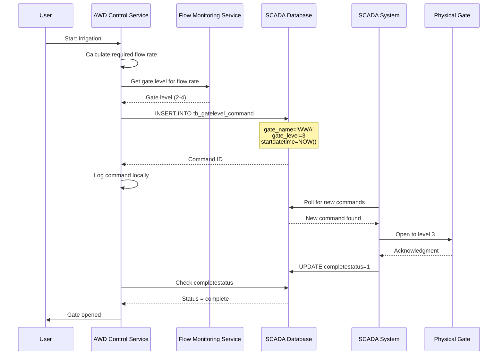

# SCADA Gate Control Integration

## Overview
The AWD Control Service now integrates directly with the SCADA database (`db_scada`) to control irrigation gates. This document describes the integration architecture and implementation.

## Key Changes
1. **No Pump Control**: All pump-related functionality has been removed
2. **Direct Database Integration**: Commands written to `tb_gatelevel_command` table
3. **Gate Level Mapping**: 20 automatic gate control sites with 4 levels each
4. **Flow Monitoring Integration**: Uses Flow Monitoring Service for hydraulic calculations

## Database Structure

### SCADA Database (`db_scada`)
```sql
-- Gate control commands table
tb_gatelevel_command:
  - id (auto increment)
  - gate_name (VARCHAR) -- matches stationcode from tb_site
  - gate_level (INT) -- 1=closed, 2=level1, 3=level2, 4=level3
  - startdatetime (TIMESTAMP)
  - completestatus (INT) -- 0=pending, 1=complete

-- Site information
tb_site:
  - stationcode (VARCHAR) -- gate identifier
  - site_name (VARCHAR)
  - ... other fields
```

### AWD Database (`munbon_dev.awd`)
```sql
-- Field to gate mapping
field_gate_mapping:
  - field_id
  - station_code -- maps to tb_site.stationcode
  - max_flow_rate

-- Command tracking
scada_command_log:
  - scada_command_id -- from tb_gatelevel_command.id
  - field_id
  - gate_name
  - gate_level
  - status -- sent/completed/failed
```

## Gate Control Flow



## API Integration

### 1. Start Irrigation
```typescript
POST /api/v1/awd/control/fields/:fieldId/irrigation/start
{
  "targetLevelCm": 10,
  "targetFlowRate": 8.5  // Optional m³/s
}

// Process:
1. Get field's station code
2. Calculate flow rate if not provided
3. Call Flow Monitoring to get gate level
4. Insert command to tb_gatelevel_command
5. Start water level monitoring
```

### 2. Stop Irrigation
```typescript
POST /api/v1/awd/control/fields/:fieldId/irrigation/stop
{
  "reason": "Target reached"
}

// Process:
1. Get field's station code
2. Insert close command (gate_level=1)
3. Stop monitoring
```

## Flow Monitoring Service Integration

The AWD Control Service calls the Flow Monitoring Service to:

1. **Calculate Gate Level for Flow**
   ```typescript
   POST http://localhost:3012/api/v1/hydraulic/gate-level
   {
     "stationCode": "WWA",
     "targetFlowRate": 8.5  // m³/s
   }
   
   Response:
   {
     "gateLevel": 3,
     "expectedFlow": 8.7,
     "confidence": 0.95
   }
   ```

2. **Get Canal Water Levels**
   ```typescript
   GET http://localhost:3012/api/v1/water-levels
   
   Response:
   {
     "sections": [
       {
         "sectionId": "MC-01",
         "waterLevel": 2.45,
         "flow": 125.3
       }
     ]
   }
   ```

## Gate Level Mapping

Most gates have 4 control levels:

| Level | Status | Typical Flow | Usage |
|-------|--------|--------------|-------|
| 1 | Closed | 0 m³/s | No irrigation |
| 2 | Level 1 | 3-5 m³/s | Light irrigation |
| 3 | Level 2 | 6-8 m³/s | Normal irrigation |
| 4 | Level 3 | 9-12 m³/s | Heavy irrigation |

## Configuration

### Environment Variables
```env
# SCADA Database (same as AOS)
SCADA_DB_HOST=43.209.22.250
SCADA_DB_PORT=5432
SCADA_DB_NAME=db_scada
SCADA_DB_USER=postgres
SCADA_DB_PASSWORD=P@ssw0rd123!

# Flow Monitoring Service
FLOW_MONITORING_URL=http://localhost:3012
SERVICE_AUTH_TOKEN=your-service-auth-token
```

### Field Configuration
Each field must be mapped to a station code:
```sql
INSERT INTO awd.field_gate_mapping (field_id, station_code)
VALUES ('field-uuid', 'WWA');
```

## Monitoring and Status

### Command Status Check
The service monitors command completion:
```typescript
// Every 30 seconds
1. Query pending commands from local log
2. Check completestatus in tb_gatelevel_command
3. Update local status when complete
4. Publish completion events
```

### Water Level Monitoring
During irrigation:
```typescript
// Every 5 minutes
1. Read water level sensors
2. Calculate flow rate
3. Check for anomalies
4. Adjust gate if needed
5. Store canal levels from Flow Monitoring
```

## Error Handling

### Gate Command Failures
- Retry logic not implemented (SCADA handles retries)
- Failures logged locally for analysis
- Alerts sent via Kafka

### Sensor Failures
- Continue irrigation with last known good values
- Alert operators
- Switch to manual control if critical

## Testing

### Manual Gate Control Test
```bash
# Insert test command directly
psql -h 43.209.22.250 -U postgres -d db_scada -c "
INSERT INTO tb_gatelevel_command 
(gate_name, gate_level, startdatetime, completestatus)
VALUES ('WWA', 3, NOW(), 0);"

# Check status
psql -h 43.209.22.250 -U postgres -d db_scada -c "
SELECT * FROM tb_gatelevel_command 
ORDER BY id DESC LIMIT 5;"
```

### API Test
```bash
# Start irrigation
curl -X POST http://localhost:3013/api/v1/awd/control/fields/123/irrigation/start \
  -H "Authorization: Bearer $TOKEN" \
  -H "Content-Type: application/json" \
  -d '{
    "targetLevelCm": 10,
    "targetFlowRate": 7.5
  }'

# Check status
curl http://localhost:3013/api/v1/awd/control/fields/123/irrigation/status \
  -H "Authorization: Bearer $TOKEN"
```

## Migration from Old System

1. **Remove Pump References**: All pump control code has been removed
2. **Update Field Mappings**: Ensure all fields have station codes
3. **Test Gate Control**: Verify SCADA picks up commands
4. **Monitor Performance**: Track gate response times

## Future Enhancements

1. **Real-time Gate Position Feedback**: When SCADA provides position sensors
2. **Multi-gate Coordination**: Optimize multiple gates for single field
3. **Predictive Control**: Use ML to predict optimal gate timings
4. **Emergency Overrides**: Direct gate control for critical situations