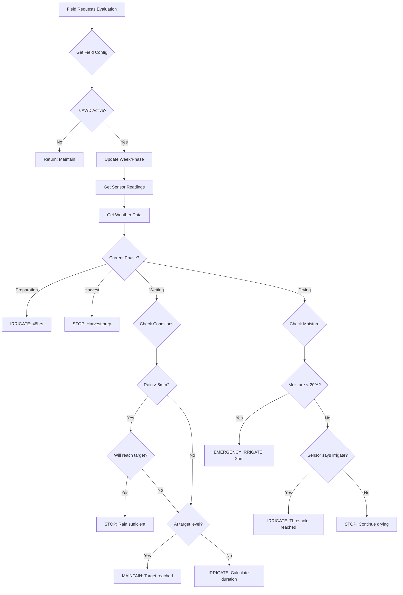

# Smart Irrigation Decision Making - Detailed Documentation

## Overview
The AWD Control Service makes intelligent irrigation decisions by analyzing multiple factors in real-time. The decision-making process is implemented in the `makeControlDecision()` method and follows a sophisticated algorithm that considers crop growth stages, weather conditions, sensor readings, and field priorities.

## 1. Growth Stage-Based Decision Logic

### 1.1 Schedule Templates
The service uses two predefined schedules based on planting method:

#### **Transplanted Rice Schedule (14 weeks)**
```typescript
Week 0:  Preparation Phase - Flood to 10cm
Week 1:  First Drying - 7 days (0cm target)
Week 2-3: First Wetting - 14 days (10cm) + FERTILIZER
Week 4-6: Second Drying - 21 days (0cm)
Week 7:  Second Wetting - 7 days (10cm)
Week 8-9: Third Drying - 14 days (0cm)
Week 10-11: Third Wetting - 14 days (10cm)
Week 12-13: Fourth Drying - 14 days (0cm)
Week 14: Harvest Preparation
```

#### **Direct-Seeded Rice Schedule (15 weeks)**
```typescript
Week 0:  Preparation Phase - Flood to 10cm
Week 1-2: First Drying - 14 days (0cm)
Week 3-4: First Wetting - 14 days (10cm) + FERTILIZER  
Week 5-7: Second Drying - 21 days (0cm)
Week 8:  Second Wetting - 7 days (10cm)
Week 9-10: Third Drying - 14 days (0cm)
Week 11-12: Third Wetting - 14 days (10cm)
Week 13-14: Fourth Drying - 14 days (0cm)
Week 15: Harvest Preparation
```

### 1.2 Phase-Specific Decision Rules

#### **Preparation Phase**
```typescript
Decision: ALWAYS start_irrigation
Target: 10cm water depth
Duration: 48 hours (2 days)
Reason: "Field preparation phase"
```

#### **Wetting Phase**
```typescript
if (rainfall > 5mm AND estimatedLevel >= target) {
    Decision: stop_irrigation
    Reason: "Rainfall sufficient"
} else if (currentLevel >= targetLevel) {
    Decision: maintain
    Reason: "Target level achieved"  
} else {
    Decision: start_irrigation
    Target: 10cm
    Duration: Calculate based on deficit
}
```

#### **Drying Phase**
```typescript
if (moisturePercent < 20%) {
    Decision: start_irrigation (EMERGENCY)
    Duration: 120 minutes
    Priority: HIGH
} else if (sensorCheck.needsIrrigation) {
    Decision: start_irrigation
    Reason: "Moisture threshold reached"
} else {
    Decision: stop_irrigation
    Reason: "Drying phase - Week X"
}
```

#### **Harvest Phase**
```typescript
Decision: ALWAYS stop_irrigation
Reason: "Harvest preparation phase"
Priority: HIGH notification
```

## 2. Weather Integration

### 2.1 Rainfall Impact Calculation
```typescript
private async getRainfallData(fieldId: string): Promise<RainfallData | null> {
    // Fetches from Weather Service
    // Caches in Redis for 5 minutes
    // Returns: { amount: mm, forecast: [...] }
}
```

### 2.2 Rainfall Decision Rules
- **Threshold**: 5mm (configurable)
- **Water Level Estimation**: `currentLevel + (rainfall_mm / 10)`
- **Decision Impact**:
  ```typescript
  if (rainfall.amount > RAINFALL_THRESHOLD) {
      estimatedLevel = currentLevel + (rainfall.amount / 10);
      if (estimatedLevel >= targetLevel) {
          SKIP IRRIGATION - "Rainfall sufficient"
      }
  }
  ```

### 2.3 Forecast Integration (Future Enhancement)
```typescript
// Planned implementation
if (rainfall.forecast) {
    nextRain = forecast.filter(f => 
        f.probability > 0.8 && 
        f.forecastDate < Date.now() + 6_HOURS
    );
    if (nextRain.expectedAmount > 10mm) {
        DELAY IRRIGATION
    }
}
```

## 3. Field Prioritization (Current Implementation)

### 3.1 Database Priority Level
Each field has a `priority_level` (1-10) stored in `awd_configurations` table:
- **1-3**: Low priority
- **4-6**: Medium priority  
- **7-10**: High priority

### 3.2 Current Priority Factors
While full queue management isn't implemented, the service considers:

1. **Emergency Conditions** (Highest Priority)
   - Moisture < 20% → Immediate irrigation
   - Water stress detected → Priority HIGH

2. **Growth Stage Criticality**
   - Fertilizer application weeks → Priority HIGH
   - Reproductive stage (Week 7-10) → Priority MEDIUM-HIGH
   - Vegetative stage → Priority MEDIUM

3. **Water Deficit Level**
   - Deficit > 15cm → Priority HIGH
   - Deficit 10-15cm → Priority MEDIUM
   - Deficit < 10cm → Priority LOW

### 3.3 Planned Queue Management
```typescript
// Conceptual implementation
interface IrrigationQueueItem {
    fieldId: string;
    priority: number; // Calculated score
    requestedAt: Date;
    estimatedDuration: number;
    reason: string;
}

calculatePriority(field): number {
    let score = field.priority_level * 10;
    
    // Growth stage factor
    if (isReproductiveStage(field)) score += 30;
    if (requiresFertilizer(field)) score += 40;
    
    // Water stress factor
    if (moisturePercent < 20) score += 50;
    if (waterDeficit > 15) score += 30;
    
    // Time waiting factor
    score += (minutesWaiting / 60) * 5;
    
    return Math.min(100, score);
}
```

## 4. Irrigation Duration Calculation

### 4.1 Basic Algorithm
```typescript
private estimateIrrigationDuration(
    currentLevel: number, 
    targetLevel: number
): number {
    // Depth needed in cm
    const depthNeeded = targetLevel - currentLevel;
    
    // Assuming 1cm per hour average flow rate
    const hours = depthNeeded;
    
    // Convert to minutes, minimum 60 minutes
    return Math.max(60, hours * 60);
}
```

### 4.2 Calculation Examples
- Current: -15cm, Target: 10cm → Need 25cm → 25 hours (1500 minutes)
- Current: 5cm, Target: 10cm → Need 5cm → 5 hours (300 minutes)
- Current: 8cm, Target: 10cm → Need 2cm → 2 hours (120 minutes)

### 4.3 Future Enhancements (Planned)
```typescript
// More sophisticated calculation considering:
estimateDuration(field, currentLevel, targetLevel) {
    const baseRate = 1; // cm/hour
    
    // Adjust for field size
    const sizeMultiplier = field.area_hectares / 2.5;
    
    // Adjust for soil type
    const soilMultiplier = {
        'clay': 1.2,      // Slower absorption
        'loam': 1.0,      // Normal
        'sandy': 0.8      // Faster absorption
    }[field.soil_type];
    
    // Adjust for gate capacity
    const gateCapacity = getGateFlowRate(field.gates);
    
    const adjustedRate = baseRate * soilMultiplier / sizeMultiplier;
    const depthNeeded = targetLevel - currentLevel;
    
    return (depthNeeded / adjustedRate) * 60; // minutes
}
```

## 5. Decision Flow Summary



## 6. Real-World Decision Examples

### Example 1: Normal Drying Phase
```json
{
  "input": {
    "field": "F001",
    "week": 5,
    "phase": "drying",
    "waterLevel": -12,
    "moisture": 35,
    "rainfall": 0
  },
  "decision": {
    "action": "stop_irrigation",
    "reason": "Drying phase - Week 5",
    "notifications": []
  }
}
```

### Example 2: Emergency Moisture
```json
{
  "input": {
    "field": "F001",
    "week": 5,
    "phase": "drying",
    "waterLevel": -18,
    "moisture": 18,
    "rainfall": 0
  },
  "decision": {
    "action": "start_irrigation",
    "reason": "Moisture critically low (18%)",
    "targetLevel": 10,
    "duration": 120,
    "notifications": [{
      "type": "emergency",
      "message": "Critical moisture level - immediate irrigation",
      "priority": "high"
    }]
  }
}
```

### Example 3: Rain Override
```json
{
  "input": {
    "field": "F001",
    "week": 3,
    "phase": "wetting",
    "waterLevel": 5,
    "targetLevel": 10,
    "rainfall": 8
  },
  "decision": {
    "action": "stop_irrigation",
    "reason": "Rainfall (8mm) sufficient for target level",
    "notifications": []
  }
}
```

### Example 4: Fertilizer Week
```json
{
  "input": {
    "field": "F001",
    "week": 2,
    "phase": "wetting",
    "waterLevel": 3,
    "targetLevel": 10
  },
  "decision": {
    "action": "start_irrigation",
    "reason": "Water level (3cm) below target (10cm)",
    "targetLevel": 10,
    "duration": 420,
    "notifications": [{
      "type": "fertilizer",
      "message": "Fertilizer application recommended for First Water Application",
      "priority": "high"
    }]
  }
}
```

## 7. Intelligence Features

### 7.1 Adaptive Phase Tracking
- Automatically updates phase based on weeks elapsed
- Adjusts target water levels per phase
- Sends notifications on phase changes

### 7.2 Multi-Factor Analysis
Each decision considers:
1. Current growth phase requirements
2. Real-time sensor data (water level + moisture)
3. Weather conditions and forecasts
4. Field-specific configurations
5. Emergency thresholds

### 7.3 Safety Mechanisms
- **Moisture Emergency**: Override drying if < 20%
- **Fertilizer Reminders**: Auto-notify on specific weeks
- **Harvest Protection**: Force stop irrigation
- **Sensor Fallback**: Use GIS data if sensors fail

### 7.4 Optimization Goals
- Minimize water usage while maintaining yield
- Prevent water stress during critical stages
- Coordinate multi-field irrigation efficiently
- Reduce manual intervention needs