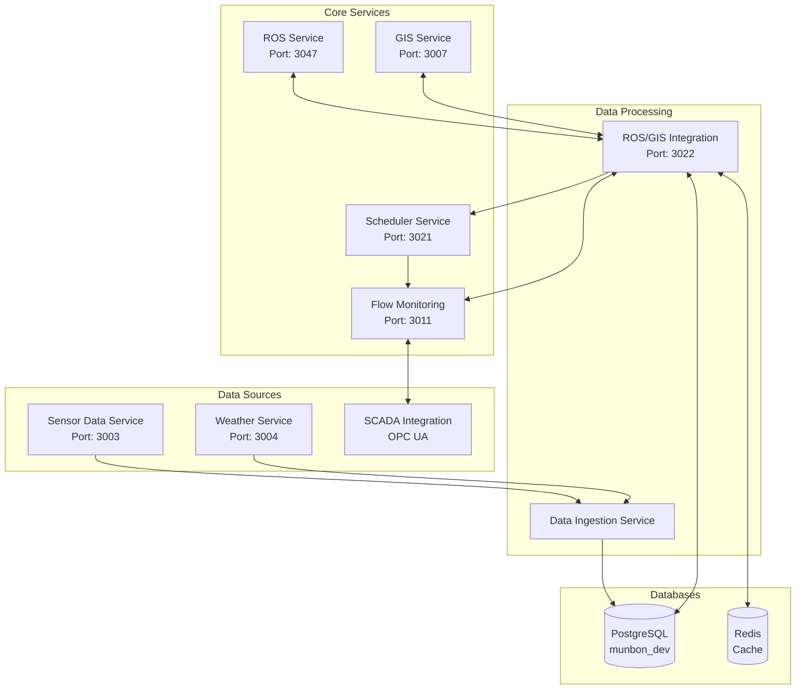

# ROS/GIS Integration Service - Detailed Data Flow Diagram

## Overview
This document provides a comprehensive view of data flowing in and out of the ROS/GIS Integration Service, showing all connections with external services and the type of data exchanged.

## Service Architecture Diagram



## Detailed Data Flows

### 1. Incoming Data to ROS/GIS Integration

#### A. From ROS Service (Port 3047)
```json
// GET /api/v1/ros/areas/{section_id}
{
  "data": {
    "areaId": "Zone_2_A",
    "totalAreaRai": 1250.5,
    "aosStation": "Khon Kaen",
    "province": "Khon Kaen"
  }
}

// GET /api/v1/ros/calendar/area/{section_id}?year=2024
{
  "data": [{
    "cropType": "rice",
    "plantingDate": "2024-01-01",
    "harvestDate": "2024-04-15",
    "cropCycle": 1,
    "variety": "RD-41"
  }]
}

// POST /api/v1/ros/water-demand/calculate
// Request:
{
  "areaId": "Zone_2_A",
  "cropType": "rice",
  "areaRai": 1250.5,
  "cropWeek": 8,
  "calendarWeek": 3,
  "calendarYear": 2024,
  "growthStage": "flowering"
}
// Response:
{
  "cropWaterDemandM3": 15000,
  "netWaterDemandM3": 13500,
  "grossWaterDemandM3": 16875,
  "kcValue": 1.2,
  "etMmDay": 5.5,
  "effectiveRainfall": 0,
  "irrigationEfficiency": 0.8
}
```

#### B. From GIS Service (Port 3007)
```json
// GET /api/v1/parcels/{section_id}
{
  "id": "Zone_2_A",
  "geometry": {
    "type": "Polygon",
    "coordinates": [[[103.15, 14.82], ...]]
  },
  "properties": {
    "areaRai": 1250.5,
    "landUseType": "rice",
    "amphoe": "พิมาย",
    "tambon": "หนองระเวียง",
    "elevation_m": 219.5,
    "soilType": "clay_loam"
  }
}

// GET /api/v1/rid-plan/parcels?amphoe=พิมาย&limit=100
{
  "type": "FeatureCollection",
  "features": [{
    "type": "Feature",
    "geometry": {...},
    "properties": {
      "parcelId": "P001",
      "areaRai": 25.5,
      "ridAttributes": {
        "seasonIrrM3PerRai": 1050,
        "maxCropAge": 120,
        "plantingMethod": "direct_seed"
      }
    }
  }]
}

// POST /api/v1/ros-demands/bulk
// Request:
{
  "demands": [{
    "sectionId": "Zone_2_A",
    "cropType": "rice",
    "growthStage": "flowering",
    "cropWeek": 8,
    "areaRai": 1250.5,
    "netDemandM3": 13500,
    "grossDemandM3": 16875,
    "moistureDeficitPercent": 15,
    "stressLevel": "moderate",
    "calendarWeek": 3,
    "calendarYear": 2024
  }]
}
```

#### C. From Data Ingestion Service (via Database)
```sql
-- AquaCrop simulation results stored in ros_gis.aquacrop_results
{
  "plot_id": "Zone_2_A_Plot_001",
  "simulation_date": "2024-01-20",
  "crop_type": "rice",
  "biomass_ton_ha": 8.5,
  "yield_ton_ha": 4.2,
  "water_productivity": 0.85,
  "canopy_cover_percent": 95,
  "soil_water_content": 0.35,
  "water_stress_coefficient": 0.92,
  "temperature_stress": 0.98,
  "harvest_index": 0.48,
  "et_accumulated_mm": 450,
  "irrigation_requirement_mm": 120,
  "deep_percolation_mm": 50,
  "runoff_mm": 10
}
```

#### D. From Flow Monitoring Service (Port 3011)
```json
// GET /api/v1/gates/state
{
  "gates": {
    "M(0,2)->Zone_2": {
      "gate_id": "M(0,2)->Zone_2",
      "current_opening": 0.75,
      "flow_rate_m3s": 2.1,
      "upstream_level_m": 3.5,
      "downstream_level_m": 2.8,
      "status": "operational"
    }
  }
}

// GET /api/v1/network/water-levels
{
  "levels": {
    "Zone_2_Main_Canal": {
      "level_m": 2.85,
      "flow_m3s": 4.2,
      "capacity_utilization": 0.6,
      "trend": "stable"
    }
  }
}

// GET /api/v1/demands/week/2024-W03
{
  "sections": [{
    "section_id": "Zone_2_A",
    "planned_volume_m3": 16875,
    "delivered_volume_m3": 15200,
    "delivery_efficiency": 0.9,
    "start_time": "2024-01-15T06:00:00Z",
    "end_time": "2024-01-15T14:00:00Z"
  }]
}
```

### 2. Internal Processing by ROS/GIS Integration

#### A. Daily Demand Calculation (6:00 AM Daily)
```python
# 1. Fetch ROS crop data
ros_data = await ros_client.get_area_info(section_id)
crop_calendar = await ros_client.get_crop_calendar(section_id)

# 2. Fetch AquaCrop results from database
aquacrop_data = await db.query(
    "SELECT * FROM ros_gis.aquacrop_results WHERE plot_id = $1",
    section_id
)

# 3. Combine using configured strategy
if settings.demand_combination_strategy == "aquacrop_priority":
    if aquacrop_data and aquacrop_data.water_stress_coefficient < 0.8:
        # Use AquaCrop's higher precision model
        water_demand_m3 = aquacrop_data.irrigation_requirement_mm * area_rai * 1.6
    else:
        # Fall back to ROS calculation
        water_demand_m3 = ros_calculation.gross_demand_m3
else:
    # Average both models
    water_demand_m3 = (aquacrop_demand + ros_demand) / 2

# 4. Store daily demand
await db.execute("""
    INSERT INTO ros_gis.daily_demands 
    (section_id, demand_date, water_demand_m3, growth_stage, stress_level)
    VALUES ($1, $2, $3, $4, $5)
""", section_id, date, water_demand_m3, growth_stage, stress_level)
```

#### B. Weekly Accumulation (Sunday Evening)
```python
# 1. Accumulate daily demands
weekly_demands = await db.query("""
    SELECT section_id, 
           SUM(water_demand_m3) as total_demand_m3,
           AVG(stress_level::numeric) as avg_stress
    FROM ros_gis.daily_demands
    WHERE demand_date BETWEEN $1 AND $2
    GROUP BY section_id
""", week_start, week_end)

# 2. Aggregate by irrigation channel
channel_demands = await db.query("""
    SELECT ic.channel_id,
           SUM(wd.total_demand_m3) as channel_demand_m3,
           COUNT(DISTINCT s.section_id) as sections_count,
           MAX(wd.total_demand_m3 / 7 / 86400) as peak_flow_m3s
    FROM weekly_demands wd
    JOIN ros_gis.sections s ON s.section_id = wd.section_id
    JOIN ros_gis.irrigation_channels ic ON ic.channel_id = s.channel_id
    GROUP BY ic.channel_id
""")

# 3. Calculate priorities
priorities = await priority_engine.calculate_priorities(
    sections=weekly_demands,
    factors={
        "crop_stage_criticality": 0.25,
        "water_stress_level": 0.20,
        "delivery_efficiency": 0.15,
        "historical_performance": 0.10,
        "area_size_equity": 0.10,
        "economic_value": 0.15,
        "social_impact": 0.05
    }
)

# 4. Optimize delivery paths
optimal_paths = await delivery_optimizer.find_optimal_paths(
    demands=channel_demands,
    network=canal_network,
    constraints={
        "max_concurrent_gates": 5,
        "min_flow_velocity_ms": 0.3,
        "max_flow_velocity_ms": 2.0
    }
)
```

### 3. Outgoing Data from ROS/GIS Integration

#### A. To Scheduler Service (Port 3021)
```json
// POST /api/v1/scheduler/demands
{
  "interval_type": "weekly",
  "week": "2024-W03",
  "start_date": "2024-01-15",
  "end_date": "2024-01-21",
  "total_demand_m3": 1250000,
  "channel_demands": {
    "channel_zone_2": {
      "channel_id": "channel_zone_2",
      "total_demand_m3": 500000,
      "peak_flow_required_m3s": 2.5,
      "sections": ["Zone_2_A", "Zone_2_B", "Zone_2_C"],
      "delivery_gates": ["M(0,2)->Zone_2"],
      "optimal_path": {
        "nodes": ["Main_Canal", "Zone_2_Primary", "Zone_2_Secondary"],
        "total_distance_km": 15.5,
        "estimated_loss_percent": 5.2,
        "travel_time_hours": 2.1
      }
    }
  },
  "section_priorities": [{
    "section_id": "Zone_2_A",
    "priority_score": 0.85,
    "factors": {
      "crop_stage": "flowering",
      "stress_level": "high",
      "area_rai": 1250.5,
      "economic_value": 45000000
    },
    "required_volume_m3": 16875,
    "delivery_window": {
      "earliest": "2024-01-15T06:00:00Z",
      "latest": "2024-01-17T18:00:00Z",
      "preferred_duration_hours": 8
    }
  }],
  "constraints": {
    "max_concurrent_gates": 5,
    "maintenance_windows": [{
      "gate_id": "M(1,3)->Zone_3",
      "start": "2024-01-17T08:00:00Z",
      "end": "2024-01-17T16:00:00Z"
    }],
    "hydraulic_constraints": {
      "min_canal_level_m": 2.0,
      "max_flow_change_rate_m3s_per_hour": 0.5
    }
  }
}

// Response from Scheduler:
{
  "schedule_id": "SCH-2024-W03",
  "status": "confirmed",
  "total_operations": 42,
  "estimated_completion": "2024-01-21T18:00:00Z",
  "conflicts_resolved": 3
}
```

#### B. To Flow Monitoring Service (Port 3011)
```json
// POST /api/v1/hydraulics/verify-schedule
{
  "proposed_operations": [{
    "gate_id": "M(0,2)->Zone_2",
    "action": "set_opening",
    "target_opening": 0.8,
    "start_time": "2024-01-15T06:00:00Z",
    "duration_hours": 8,
    "expected_flow_m3s": 2.5,
    "sections_served": ["Zone_2_A", "Zone_2_B"]
  }],
  "constraints": {
    "max_water_level_m": 4.0,
    "min_downstream_level_m": 2.0,
    "protect_downstream": true
  }
}

// Response:
{
  "feasible": true,
  "warnings": [],
  "predicted_levels": {
    "Zone_2_Main_Canal": {
      "initial_m": 2.85,
      "peak_m": 3.45,
      "final_m": 3.20
    }
  },
  "estimated_losses_percent": 5.2
}

// POST /api/v1/performance/feedback
{
  "section_id": "Zone_2_A",
  "week": "2024-W03",
  "planned_volume_m3": 16875,
  "delivered_volume_m3": 15200,
  "delivery_efficiency": 0.9,
  "issues": ["minor_gate_delay"],
  "farmer_satisfaction": 4.2,
  "crop_response": "positive"
}
```

#### C. To PostgreSQL Database (munbon_dev.ros_gis schema)
```sql
-- Daily demand storage
INSERT INTO ros_gis.daily_demands (
    section_id, demand_date, crop_type, growth_stage,
    water_demand_m3, stress_level, et_mm, kc_value,
    effective_rainfall_mm, data_source
) VALUES (
    'Zone_2_A', '2024-01-20', 'rice', 'flowering',
    2410.7, 'moderate', 5.5, 1.2, 0, 'combined'
);

-- Accumulated demands
INSERT INTO ros_gis.accumulated_demands (
    section_id, interval_type, start_date, end_date,
    total_demand_m3, peak_daily_demand_m3, avg_stress_level,
    priority_score, delivery_efficiency_target
) VALUES (
    'Zone_2_A', 'weekly', '2024-01-15', '2024-01-21',
    16875, 2410.7, 0.15, 0.85, 0.9
);

-- Gate mapping updates
UPDATE ros_gis.gate_mappings 
SET utilization_percent = 75.5,
    last_flow_m3s = 2.1,
    last_operation_time = '2024-01-15T06:00:00Z'
WHERE gate_id = 'M(0,2)->Zone_2';

-- Performance tracking
INSERT INTO ros_gis.section_performance (
    section_id, week_number, year, planned_m3, delivered_m3,
    delivery_efficiency, on_time_delivery, farmer_feedback,
    crop_health_index, issues_reported
) VALUES (
    'Zone_2_A', 3, 2024, 16875, 15200,
    0.9, true, 4.2, 0.92, '["minor_gate_delay"]'::jsonb
);
```

#### D. To Redis Cache (Port 6379)
```python
# Cache keys and data structures

# 1. Section demand cache (TTL: 5 minutes)
cache_key = "demand:Zone_2_A:2024-W03"
cache_data = {
    "water_demand_m3": 16875,
    "priority_score": 0.85,
    "growth_stage": "flowering",
    "last_updated": "2024-01-20T06:00:00Z"
}

# 2. Aggregated channel demands (TTL: 15 minutes)
cache_key = "channel:channel_zone_2:demands"
cache_data = {
    "total_demand_m3": 500000,
    "sections": ["Zone_2_A", "Zone_2_B", "Zone_2_C"],
    "peak_flow_m3s": 2.5,
    "cached_at": "2024-01-20T06:15:00Z"
}

# 3. Optimal path cache (TTL: 1 hour)
cache_key = "path:Main_Canal:Zone_2_A"
cache_data = {
    "path": ["Main_Canal", "Zone_2_Primary", "Zone_2_Secondary"],
    "distance_km": 15.5,
    "travel_time_hours": 2.1,
    "loss_percent": 5.2
}

# 4. Performance metrics cache (TTL: 30 minutes)
cache_key = "performance:weekly:2024-W03"
cache_data = {
    "total_sections": 200,
    "avg_delivery_efficiency": 0.88,
    "on_time_deliveries": 185,
    "total_volume_delivered_m3": 1125000
}
```

### 4. GraphQL API Data Exchange

#### A. Query Examples
```graphql
# Get section details with performance
query GetSectionDetails {
  section(id: "Zone_2_A") {
    id
    zone
    areaRai
    currentCrop
    growthStage
    waterStress
    deliveryGate
    lastDelivery {
      date
      volumeM3
      efficiency
    }
  }
  
  sectionPerformance(sectionId: "Zone_2_A", weeks: 4) {
    weekNumber
    year
    plannedM3
    deliveredM3
    efficiency
    onTimeDelivery
    issues
  }
}

# Get gate utilization
query GetGateUtilization {
  gateMappings {
    gateId
    gateType
    sectionsCount
    totalAreaRai
    utilizationPercent
    currentFlowM3s
    maxFlowM3s
  }
}
```

#### B. Mutation Examples
```graphql
# Submit weekly demands
mutation SubmitWeeklyDemands {
  submitDemands(
    week: "2024-W03"
    demands: [{
      sectionId: "Zone_2_A"
      volumeM3: 16875
      priority: CRITICAL
      cropStage: "flowering"
      stressLevel: 0.15
    }]
  ) {
    scheduleId
    status
    conflicts {
      type
      description
      resolution
    }
    estimatedCompletion
  }
}

# Update performance feedback
mutation UpdatePerformance {
  recordDeliveryPerformance(
    sectionId: "Zone_2_A"
    week: "2024-W03"
    feedback: {
      deliveredM3: 15200
      efficiency: 0.9
      farmerRating: 4.2
      issues: ["minor_gate_delay"]
    }
  ) {
    success
    performanceScore
    recommendations
  }
}
```

## Data Volume Estimates

### Daily Processing
- **Sections monitored**: ~200
- **Daily demand records**: 200 records/day
- **AquaCrop simulations**: 1,000 plots × 1 record/day = 1,000 records
- **Cache operations**: ~10,000 reads/day, ~2,000 writes/day

### Weekly Processing
- **Accumulated demands**: 200 sections × 7 days = 1,400 records aggregated
- **Channel aggregations**: 20 channels
- **Priority calculations**: 200 sections ranked
- **Path optimizations**: ~50 unique paths calculated

### API Traffic
- **GraphQL queries**: ~500/day
- **REST API calls to external services**: ~2,000/day
- **Database queries**: ~20,000/day
- **Cache hit ratio**: ~75%

## Error Handling and Fallbacks

### Service Unavailability
```python
# If ROS Service is down
if not ros_service_available:
    # Use last known good data from cache/database
    water_demand = await get_cached_demand(section_id)
    if not water_demand:
        # Fall back to historical average
        water_demand = await calculate_historical_average(section_id, crop_type, week)

# If GIS Service is down
if not gis_service_available:
    # Use stored spatial data from database
    spatial_data = await db.query(
        "SELECT * FROM ros_gis.sections WHERE section_id = $1",
        section_id
    )

# If Flow Monitoring is down
if not flow_monitoring_available:
    # Skip hydraulic verification, mark as "unverified"
    schedule_request["hydraulic_verification"] = "pending"
```

### Data Quality Issues
```python
# Validate incoming data
def validate_demand_data(demand):
    if demand.water_demand_m3 < 0:
        raise ValueError("Negative water demand")
    
    if demand.water_demand_m3 > demand.area_rai * 2000:
        # Suspiciously high demand
        log.warning("Unusually high demand", section=demand.section_id)
        demand.flags.append("high_demand_warning")
    
    if demand.stress_level > 1.0 or demand.stress_level < 0:
        demand.stress_level = max(0, min(1.0, demand.stress_level))
    
    return demand
```

## Summary

The ROS/GIS Integration Service acts as the central hub for:
1. **Collecting** water demand data from multiple sources (ROS, AquaCrop, GIS)
2. **Processing** and combining demands using configurable strategies
3. **Aggregating** demands spatially (by section, channel, zone)
4. **Optimizing** delivery paths through the canal network
5. **Prioritizing** sections based on multiple factors
6. **Preparing** scheduling requests for the Scheduler Service
7. **Tracking** performance and feedback for continuous improvement

The service processes approximately 200 sections daily, accumulates weekly demands, and coordinates with 5+ external services to ensure efficient water distribution across the Munbon irrigation system.