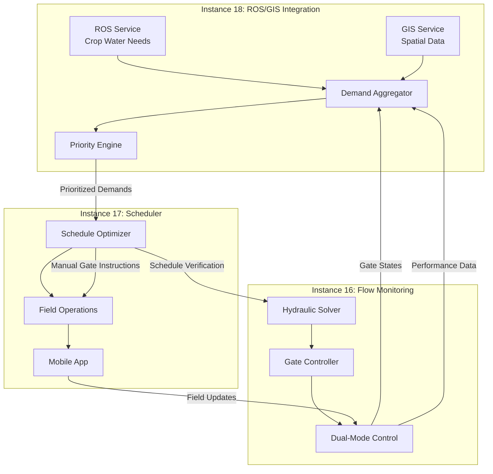

# Detailed Relationships Among Instances 16, 17, and 18

## Overview of the Three-Instance Architecture



## Instance 16: Core Flow Monitoring (Port 3011)

### Purpose
The hydraulic brain of the system - calculates water physics and controls gates.

### Key Responsibilities
1. **Hydraulic Calculations**
   - Solves water flow equations: Q = Cs × L × Hs × √(2g × ΔH)
   - Calculates water levels throughout the network
   - Determines travel times between nodes
   - Predicts water propagation

2. **Gate Control**
   - Manages 59 gates across 6 zones
   - Dual-mode operation (automated/manual)
   - Conflict resolution between modes
   - Real-time state tracking

3. **APIs Provided**
   ```
   GET  /api/v1/gates/state              → Current gate positions
   POST /api/v1/hydraulics/verify-schedule → Check if schedule is feasible
   PUT  /api/v1/gates/manual/{id}/state  → Update manual gate
   GET  /api/v1/network/water-levels     → Current water levels
   ```

## Instance 17: Scheduler & Field Operations (Port 3021)

### Purpose
The logistics coordinator - optimizes weekly schedules and manages field teams.

### Key Responsibilities
1. **Schedule Optimization**
   - Receives demands from Instance 18
   - Optimizes for minimal field team travel
   - Balances competing water needs
   - Generates weekly operation plans

2. **Field Team Management**
   - Creates manual gate instructions
   - Manages team assignments (Tuesday/Thursday)
   - Provides GPS navigation
   - Handles offline operation

3. **APIs Provided**
   ```
   POST /api/v1/scheduler/demands        → Receive demands from Instance 18
   GET  /api/v1/schedule/week/{week}     → Get optimized schedule
   GET  /api/v1/field-ops/instructions   → Field team instructions
   POST /api/v1/sync                     → Sync mobile app data
   ```

## Instance 18: ROS/GIS Integration (Port 3022)

### Purpose
The agricultural translator - converts crop needs into hydraulic demands.

### Key Responsibilities
1. **Demand Aggregation**
   - Collects crop water requirements (ROS)
   - Maps sections to delivery gates (GIS)
   - Groups demands by infrastructure
   - Applies weather adjustments

2. **Priority Resolution**
   - Multi-factor priority calculation
   - Crop stage criticality
   - Economic value weighting
   - Stress indicator integration

3. **GraphQL API**
   ```graphql
   mutation SubmitDemands {
     submitDemands(week: "2024-W03", demands: [...]) {
       scheduleId
       status
     }
   }
   
   query SectionPerformance {
     section(id: "Zone_2_Section_A") {
       deliveries(weeks: 4) {
         efficiency
       }
     }
   }
   ```

## Detailed Interaction Flow

### 1. Weekly Planning Cycle (Monday)

```
Instance 18                Instance 17                Instance 16
-----------                -----------                -----------
Collect crop needs    →
Map to gates         →
Calculate priorities →
Aggregate by gate    →
                          Receive demands      →
                          Check capacity       →
                                                    Verify hydraulics
                          ← Feasibility check   ←
                          Optimize schedule    →
                          Generate instructions →
                                                    Set automated gates
```

### 2. Field Execution (Tuesday/Thursday)

```
Instance 17                Instance 16                Instance 18
-----------                -----------                -----------
Deploy field teams   →
Navigate to gates    →
                          Update manual gates  →
                          Track state changes  →
                                                    Monitor delivery
Sync mobile data     →
                          Calculate flows      →
                                                    ← Performance data
                                                    Update crop models
```

### 3. Real-time Adaptation

```
Instance 16                Instance 17                Instance 18
-----------                -----------                -----------
Detect gate failure  →
                          Receive alert        →
                          Adjust schedule      →
                                                    Recalculate priorities
                          ← New priorities      ←
                          Update field teams   →
```

## Why We Need the Mock Server (Port 3099)

### 1. **Parallel Development**
```
Developer A (Instance 16) ─┐
Developer B (Instance 17) ─┼─→ Mock Server ←─→ Testing
Developer C (Instance 18) ─┘
```
- All three instances can be developed simultaneously
- No waiting for other services to be ready
- Consistent test data across all instances

### 2. **Isolated Testing**
The mock server provides:
- Predictable responses for unit tests
- Error simulation capabilities
- Performance testing without affecting real services
- Quick iteration during development

### 3. **API Contract Definition**
```python
# Mock server defines the contract
@app.post("/api/v1/scheduler/demands")
async def submit_demands(demands: Dict):
    return {
        "schedule_id": "SCH-2024-W03-1234",
        "status": "processing",
        "conflicts": [],
        "estimated_completion": "2024-01-15T10:30:00Z"
    }
```
- Serves as living documentation
- All instances agree on data formats
- Changes to contracts are immediately visible

### 4. **Development Scenarios**

**Scenario A: Testing Demand Submission**
```
Instance 18 → Mock Server (simulates Instance 17)
            ← Returns schedule_id, conflicts
```

**Scenario B: Testing Gate Control**
```
Instance 17 → Mock Server (simulates Instance 16)
            ← Returns gate states, water levels
```

**Scenario C: Testing Full Flow**
```
Instance 18 → Mock Server → Instance 17 → Mock Server → Instance 16
                  ↓                             ↓
            (Mock ROS/GIS)              (Mock sensor data)
```

### 5. **Gradual Integration**
```python
# In Instance 18 settings
USE_MOCK_SERVER = True  # Development
# Later...
USE_MOCK_SERVER = False # Production
```
- Start with 100% mocked services
- Gradually replace with real services
- Easy rollback if issues arise

## Data Flow Examples

### Example 1: Farmer Needs Water
```
1. ROS calculates: "Rice in Zone 2 needs 100mm this week"
   ↓
2. Instance 18 translates: "Zone_2_Section_A needs 15,000 m³"
   ↓
3. Instance 18 aggregates: "Gate M(0,2)→Zone_2 needs 45,000 m³ total"
   ↓
4. Instance 17 schedules: "Team A opens gate Tuesday 8am-12pm"
   ↓
5. Instance 16 calculates: "Flow rate 3.5 m³/s will deliver in 4 hours"
   ↓
6. Field team executes, Instance 16 tracks actual delivery
   ↓
7. Instance 18 feeds back: "Zone_2_Section_A received 14,250 m³ (95%)"
```

### Example 2: Gate Failure Adaptation
```
1. Instance 16 detects: "Gate M(0,2)→Zone_2 failed to open"
   ↓
2. Instance 17 notified: "Manual intervention required"
   ↓
3. Instance 17 alerts: "Team B diverted to manual operation"
   ↓
4. Instance 18 informed: "Delivery delayed 2 hours"
   ↓
5. Instance 18 adjusts: "Increase priority for next cycle"
```

## Configuration for Integration

### Instance 18 knows about others:
```env
FLOW_MONITORING_URL=http://localhost:3011  # Instance 16
SCHEDULER_URL=http://localhost:3021        # Instance 17
USE_MOCK_SERVER=true                        # For development
MOCK_SERVER_URL=http://localhost:3099      # Mock everything
```

### Instance 17 knows about others:
```env
FLOW_MONITORING_URL=http://localhost:3011  # Instance 16
ROS_GIS_URL=http://localhost:3022         # Instance 18
```

### Instance 16 is self-contained:
- Doesn't need to know about others
- Provides APIs that others consume
- Focuses purely on hydraulics

## Summary

The three instances work together like a well-coordinated team:
- **Instance 16** is the engineer (knows water physics)
- **Instance 17** is the logistics manager (organizes operations)
- **Instance 18** is the agricultural advisor (understands crop needs)

The Mock Server acts as a practice dummy during training, allowing each team member to perfect their skills before working together in production.